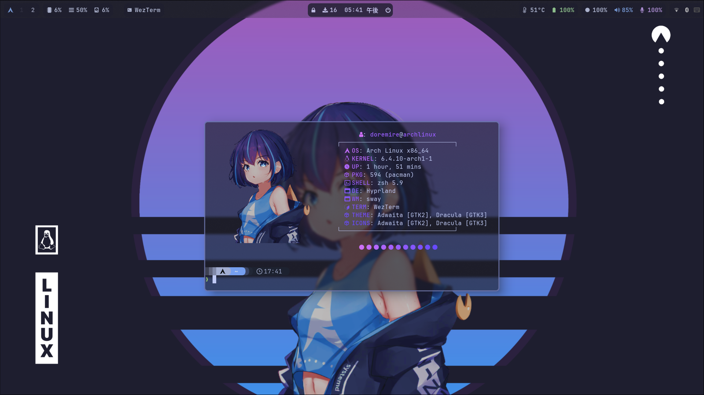

<br>
<br>
<br>
<br>
<p align="center">
  
</p>

<h1 align="center">Dotfiles🌴</h1>

<div align="center"><p>


<br>


</div>

<p align="center">
  <strong>洗練されたdotfiles</strong>
  <br>
  個人的とは言え、誰でも気軽にセットアップできるようになっています。<br>
  既存の構成に導入するのは推奨しません。
 
  <!-- <br>
  <a href="https://github.com/your-username/your-repo/wiki">[ドキュメント]</a>
  ·
  <a href="https://github.com/your-username/your-repo/issues">[バグを報告]</a>
  ·
  <a href="https://github.com/your-username/your-repo/issues">[新機能の提案]</a> -->
</p>

<br>

## 🌌 概要

このリポジトリは、私が日常的に使用しているArch LinuxのDotFilesが含まれています。<br>

カスタム設定やエイリアス、使い慣れたツールの設定などが含まれており、これを使用することでどんなマシン上でも私の理想的な作業環境をすぐに構築できます。


<br>

### 構成

```

  Dotfiles🌴
    │
    ├─ 📁 assets
    │   └─ スクリーンショットの画像など
    ├─ 📁 config
    │   └─ 設定ディレクトリ
    ├─ 📁 extras
    │   └─ .config以外の設定
    ├─ 📁 scripts
    │   └─ セットアップスプリクトやカスタムスプリクトなど
    └─ 📁 zsh
         └─ zshの設定

```

```

  キーボードショートカットのガイド

      Windowsキー: 以下のショートカットの基本となるキーです。

      アプリケーションの操作:
          Windows + Q: ターミナルの起動
          Windows + L: 画面のロック
          Windows + E: ファイルマネージャの起動
          Windows + R: アプリケーションのランチャーを開く
          Windows + M: ログアウト画面の表示
          Windows + SHIFT + M: プログラムの終了

      ウィンドウの操作:
          Windows + C: 現在のウィンドウを閉じる
          Windows + F: ウィンドウのフリーモード切り替え
          Windows + P: 画面のレイアウトスタイルの変更
          Windows + J: 画面分割の切り替え

      その他:
          PrtSc: スクリーンショットの撮影

```
|                            | Configuration                                                                         |
|----------------------------|:-------------------------------------------------------------------------------------:|
| **OS**                 | Arch Linux                                         |
| **Color scheme**           | [dracula](https://github.com/dracula/dracula-theme)                  |
| **Window manager**         | [Hyprland](https://github.com/hyprwm/Hyprland) (with LegacyRenderer)                  |
| **Terminal**               | [wezterm](https://wezfurlong.org/wezterm/)                                            |
| **Status bar**             | [Waybar](https://github.com/Alexays/Waybar)                                           |
| **Text editor**            | [neovim](https://neovim.io/)                                                          |
| **Browser**                | [Firefox](https://www.mozilla.org/et) with Japanese localization (`firefox-i18n-ja`)  |
| **Fetching**               | [neofetch](https://github.com/dylanaraps/neofetch)                                    |
| **Input method framework** | [Fcitx5](https://github.com/fcitx/fcitx5) with [Mozc](https://www.google.co.jp/ime/)  |
| **File manager**           | [Thunar](https://xfce.org/about/news/?post=1525128000)                                |
| **Application launcher**   | [Wofi (for Wayland)](https://hg.sr.ht/~scoopta/wofi)                                  |
| **Notification daemon**    | [Mako (for Wayland)](https://github.com/emersion/mako)                                |
| **Display manager**        | [sddm](https://github.com/sddm/sddm) with [sddm-theme-corners](https://github.com/aczw/sddm-theme-corners) |
| **Logout menu**            | [wlogout (for Wayland)](https://github.com/ArtsyMacaw/wlogout)                         |
| **Lock screen**            | [swaylock-effects](https://github.com/mortie/swaylock-effects)                         |
| **Fonts**                  | [Noto CJK](https://www.google.com/get/noto/), [Font Awesome](https://fontawesome.com/), [ttf-nerd-fonts-symbols](https://www.nerdfonts.com/), [JetBrains Mono Nerd](https://www.jetbrains.com/lp/mono/), and others |
| **Languages**              | ja_JP                                                          |

```

セットアップスプリクトの実行フロー

  1. **環境確認**:
      - スクリプトを開始する前にユーザーに確認を求める
      - システムのチェックを行う
      - インターネット接続をチェックする
      - gitのインストールをチェックする
      - VMの環境をチェックする
      - NVIDIAの利用をチェックする
      - システム言語をチェックする
      - キーボードのレイアウトをチェックする

  2. **AURインストール**:
      - yay(AURヘルパー)のインストール

  3. **ソフトウェアのインストール**:
      - パッケージのインストールステップを表示
      - 各パッケージのインストール結果を表示

  4. **設定のコピー**:
      - zshのdotfilesをコピー
      - その他のconfigファイルをコピー

  5. **サービスの有効化**:
      - Bluetoothサービスの起動
      - SDDMサービスの有効化

  6. **テーマの設定**:
      - GTKとアイコンのテーマを設定
      - fcitx5のテーマを設定
      - テーマを有効にするための設定ファイルを修正

  7. **シェルの変更**:
      - デフォルトのシェルをZshに変更

  8. **ファイルの権限設定**:
      - 一部のスクリプトファイルに実行権限を与える

  9. **その他の設定**:
      - 必要なディレクトリの作成など、重要度の低いアクションを実行

```

## 特徴

  - 🚀 **迅速なセットアップスプリクト**
  
    └ 強力なセットアップスクリプトにより、複雑な操作なしで手軽に環境を構築できます。

    根拠
    - TTYをサポートしたグラフィカルなインタフェース
    - ワンクリックセットアップ
    - ディスプレイマネージャーからZshの設定と幅広い自動設定

  - 🪐 **強力なカスタムスプリクト**
  
    └ 継続的な管理の為の強力なカスタムスプリクトが入っています。
  
    根拠
    - よりグラフィカルなアップデートスプリクトによる継続的なコミット 

  - ⛺ **美しいデザイン**
    
    └ より美学的なデスクトップ

    根拠
    - 統一されたカラースキーム
    - オリジナルな壁紙
  
  - 📦 **幅広いツールをカバー**
      
    └ 主要なツールやアプリケーションの設定が含まれており、一度のセットアップで幅広いニーズに対応できます。

    根拠
    - 基本的な開発ツールやミーティングアプリケーションなどが入っており、正常に動作するように合わせた設定がされています。
    - Zshの基本的なプラグインが自動的にインストールされます。それに加えシンタックスハイライトプラグインなどのテーマが自動的に設定されるようにしています。

  - 🌴 **メンテナンス性**
        
    └ 設定は見易く、コメントも充実しているので、カスタマイズや更新が容易です。

    根拠
    - 無いよ😂

### 警告
- このDotFilesはArch Linuxでの使用を想定しています。その為Arch Linux以外での動作は保証できません。
- VMはサポートしていません。
- NVIDIA GPUはサポートしていません
- 日本語環境の設定が自動的に行われます。

### スクリーンショット


多角的なアプローチによるより美学的なデスクトップ
<div align="center">
  
</div>


`注意: 常に更新している為、画像と異なっている場合があります。`

TTYを完全サポートしたグラフィカルなセットアップスプリクト
<div align="center">
  
  
</div>

セットアップを始める前に、提供されているパッケージとツールのリストを確認することをおすすめします。
## セットアップ

```bash
git clone https://github.com/doremire/dotfiles.git
cd dotfiles/scripts
sudo chmod +x setup
./setup
```

### 壁紙について
  
  
  壁紙は中央のイラストを除きスマホで制作...とは言えないので加工して作ったものです。

  元のイラスト: https://www.pixiv.net/artworks/109665466

---

### FAQ

<details>
<summary>Q. なぜdotfilesの管理にシンボリックリンクを使わないのか？
</summary>
<br>
A. シンボリックリンクはリアルタイムでの変更を反映できる利点がありますが、以下の点でディレクトリのコピー方式が優れています。<br>

1. 新しいディレクトリの追加や変更の容易さ: シンボリックリンクを使用する場合、新しいディレクトリや設定ファイルの追加ごとにリンクの作成や更新が必要になります。これは管理の手間となる可能性があります。
  
2. 一貫性の確保: ディレクトリのコピー方式を採用すると、セットアップから継続的な管理までのプロセスに一貫性が生まれます。
</details>
<br>
<details>
<summary>Q. カスタムスクリプト(アップデートスクリクト)が存在する場合、どのような影響がありますか？
</summary>
<br>
A.カスタムスクリプトが存在する場合、特にディレクトリのコピー方式との相性が良いです。なぜなら、新しいディレクトリや変更を簡単にホワイトリストに追加するだけで、アップデートスクリプトが自動で対象のディレクトリやファイルを取り扱ってくれるため、管理が非常に手軽になります。
</details>
<br>
<details>
<summary>Q. シンボリックリンク方式を選ばなかったのはカスタムスクリプトの存在だけですか？
</summary>
<br>
A. カスタムスクリプトの存在は大きな要因の一つですが、新しいディレクトリの追加や変更の容易さ、そして一貫性の確保という点でも、ディレクトリのコピー方式が合理的だと考えました。
</details>
<br>

---

### パッケージリスト

```
#-- パッケージ -----------------------------------------
dm_packages=(
    sddm # モダンなディスプレイマネージャ
    sddm-theme-corners-git
    # │
    # ├─ sddm
    # ├─ qt5-graphicaleffects
    # ├─ qt5-svg
    # ├─ qt5-quickcontrols2
    # └─ git              # バージョン管理システム
)
input_tools=(
    fcitx5-im # 入力メソッドフレームワーク
    # │
    # ├─ fcitx5
    # ├─ fcitx5-configtool
    # ├─ fcitx5-gtk
    # └─ fcitx5-qt
    fcitx5-mozc # Mozcに基づく日本語入力メソッド
)
themes=(
    dracula-icons-git
    dracula-gtk-theme
)
font_resources=(
    otf-font-awesome # アイコンフォント
    ttf-symbola      # Unicodeの記号と文字のフォント
    ttf-twemoji      # TwitterのEmoji用フォント
    noto-fonts-cjk   # GoogleのNoto CJKフォント
    ttf-nerd-fonts-symbols
    ttf-jetbrains-mono-nerd
    ttf-hack-nerd
    ttf-firacode-nerd # モノスペースのコーディング用フォント
)
dev_environments=(
    visual-studio-code-bin # 人気のあるコードエディタ
    github-cli             # GitHubのCLIツール
    neovim                 # 高機能なテキストエディタ
    gedit
    discord
    zoom
    slack-desktop
)
module_utils=(
    polkit-gnome           # GNOMEのためのPolkit認証ダイアログ
    wl-clipboard           # Waylandのクリップボードユーティリティ
    cliphist               # 不明
    pacman-contrib         # pacmanの追加ユーティリティ
    pavucontrol            # PulseAudioボリュームコントロール
    brightnessctl          # 明るさの調整ユーティリティ
    bluez                  # LinuxのBluetoothスタック
    bluez-utils            # Bluetoothユーティリティ
    blueman                # Bluetoothマネージャ
    network-manager-applet # ネットワークマネージャのアプレット
    thunar-archive-plugin  # Thunarのアーカイブプラグイン
    pipewire
    wireplumber
)
core_apps=(
    hyprland        # WM
    firefox-i18n-ja # 人気のウェブブラウザ
    thunar          # 軽量ファイルマネージャ
    wezterm         # ターミナルエミュレータ
)
wayland_apps=(
    wl-clipboard                # Waylandのクリップボードユーティリティ
    grim                        # Waylandのスクリーンショットユーティリティ
    slurp                       # Waylandの領域選択ユーティリティ
    wofi                        # Waylandのランチャー
    wlogout                     # Waylandのログアウトユーティリティ
    xdg-desktop-portal-hyprland # 不明
    mako                        # Wayland通知デーモン
    waybar                      # Wayland用のステータスバー
    swaybg                      # 壁紙
    swaylock-effects            # swayのロックスクリーン
)
unixporn=(
    neofetch     # システム情報を表示するユーティリティ
    starship     # カスタマイズ可能なシェルプロンプト
    btop         # リソースモニタ
    lxappearance # GTKテーマのカスタマイズツール
    nwg-look-bin # 同じ
    bat          #catの高機能版
    exa          #lsの高機能版
)
```

## おわり
質問や問題、提案があれば、気軽に Issue を開いて知らせてください。あなたのフィードバックは大歓迎です！

**こちらもよろしくお願いします🦊**

https://zenn.dev/doremire/scraps/7c36c04c15d43d

### 参考にしたリポジトリ

- https://github.com/SolDoesTech/HyprV4
- https://github.com/Subarupan/archdotfailid
- https://github.com/Chick2D/neofetch-themes
- https://github.com/HidemaruOwO/dotfiles
